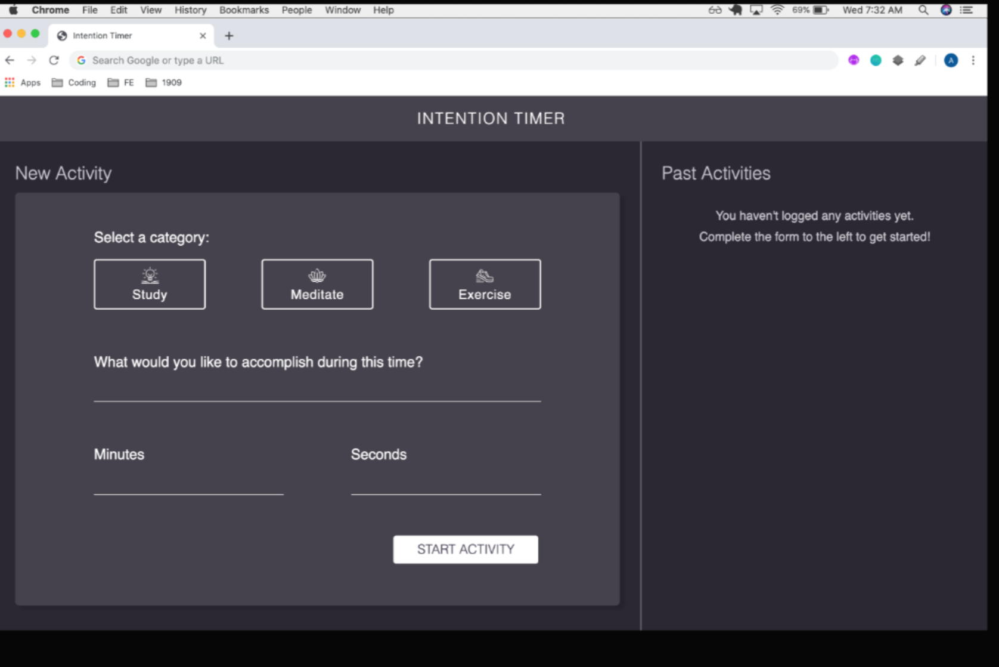
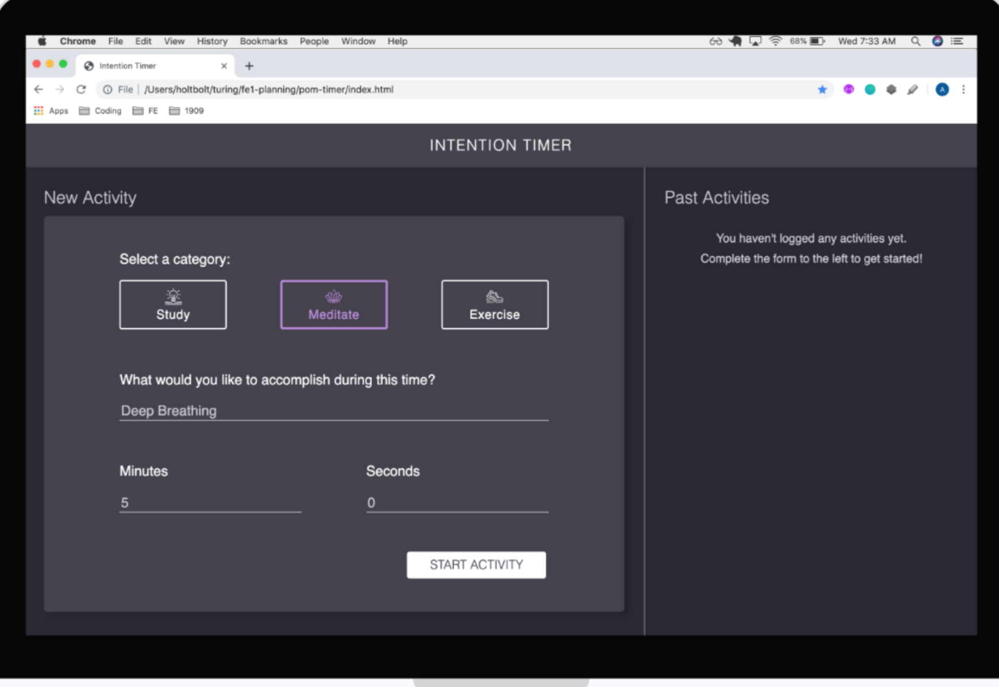
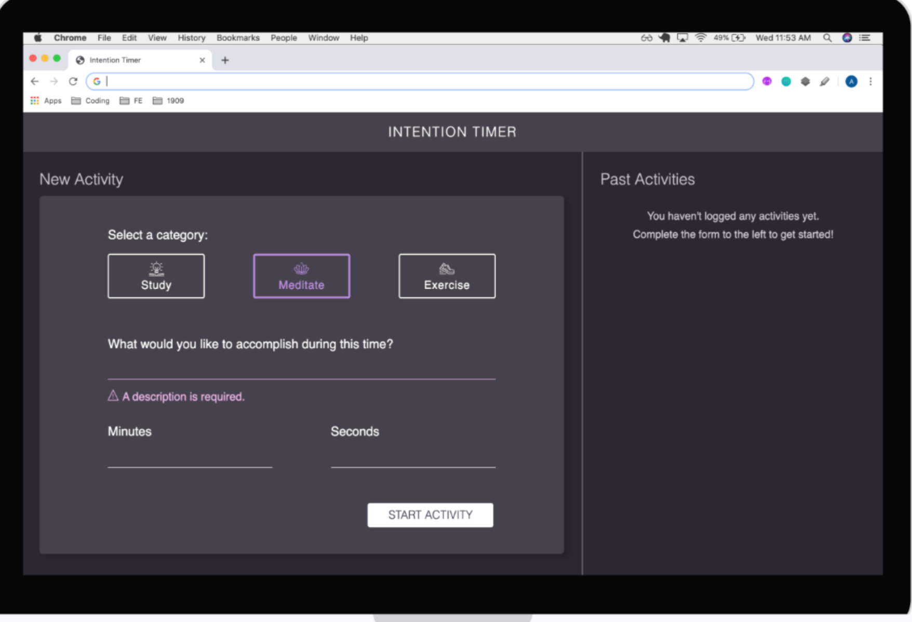
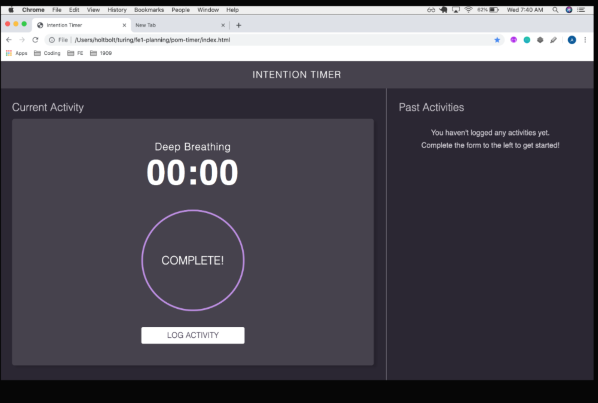
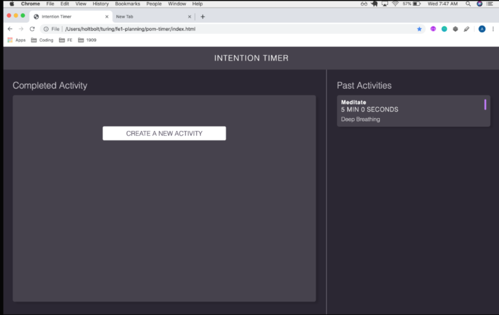
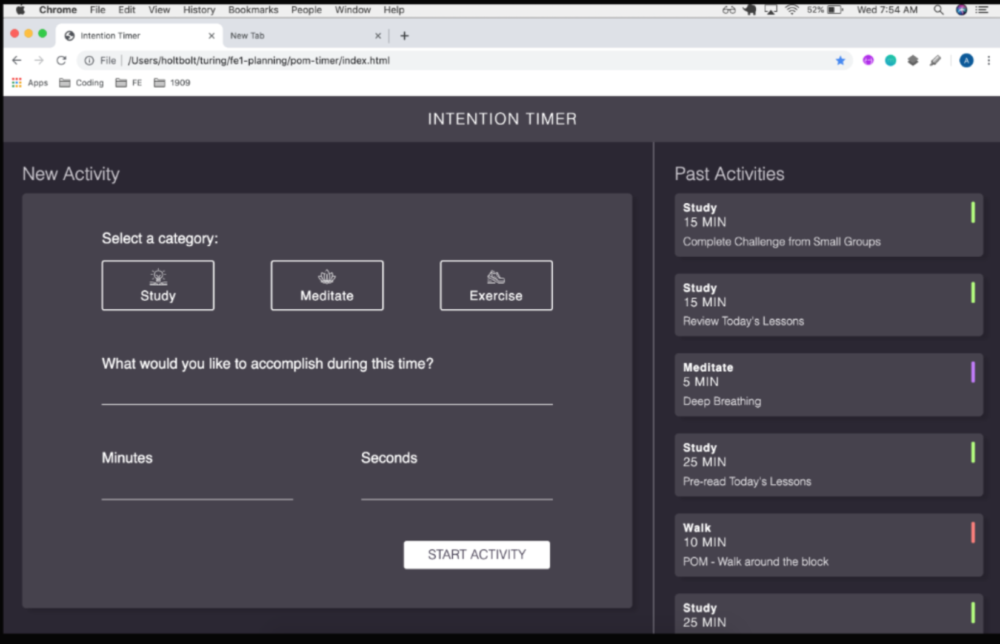

## Focus Keeper - Technical Assessment

### Overview
- You’ll be building an application that allows a user to set goals for their health and productivity, tied to an amount of time. Users will select an activity category, set the amount of time they want to spend on that activity, and start the timer. The app will log that activity to keep track of how the user has been spending their time.

### Project should contain:

- index.html
- styles.css
- Activity.js
- main.js
- assets (this is a directory that will hold your icon files)
- Deploy your application to Netlify.
- By EOD: Complete this project and make sure you send your instructor the deployed link along with the github link
the forked GitHub repo.

## Iteration 0 - Zero State
### Build the layout with HTML & CSS
- Before moving on, the header and left side of the page should match the screenshot.
- The right side of the page should only have the sub-header and note that no activities exist since you do not have past activity card functionality yet!

## Zero State Desktop

## Iteration 1 - Activity Class
STOP! Did you refactor Iteration 0? Clean up your code before moving on!

### Build out the Activity class
Properties should include:
- category
- description
- minutes
- seconds
- completed
- id
### Methods should include:
- countdown (or beginTimer or startTimer - whatever naming makes sense to you)
- markComplete
- saveToStorage
### Make sure that you link this file in your index.html using a script tag, above the link to your main.js file.

## Iteration 2 - Form Functionality
STOP! Did you refactor Iteration 1? Clean up your code before moving on!

Form Functionality
- When an activity category is clicked on (Exercise, Meditate, or Study), the associated border and icon should change colors to give a visual indication that it has been selected. Colors are provided in comp.
- An input field should be provided for What would you like to accomplish during this time?, minutes and seconds. The minutes and seconds fields should only accept numbers. (Hint: more than one layer should probably be put into place to ensure this. Make sure that e cannot be accepted.)
- A user should see an error message if they attempt to submit the form without filling out all fields. (Note: The comp shows the error message for forgetting a description - You should mimic this error messaging for all inputs.)
- A Start Activity button is provided to submit the data entered into the form. When the button is clicked, update your data model with an instance of the Activity class.
- When the Start Activity button is clicked, the user should no longer see the form, and instead see a timer clock. The timer clock should display the user-provided minutes and seconds, as well as the description. The category should not appear, but the outline of the circle should match the color associated with the category.
- If the Start Activity button is clicked before the user has entered information into all four inputs, the user will receive an error message, but will not lose any information that was provided.
Complete Form Desktop Error Message Desktop Timer Start Desktop

## Secont State Desktop

## Iteration 3 - Build an MVP
STOP! Did you refactor Iteration 2? Clean up your code before moving on!

- The user can start the time by clicking Start.
- While timer is running, the user should see it count down by second.
- When the timer completes, an alert should appear in the browser, letting the user know that the time is up and the activity has been completed.
- NOTE: This alert is temporary and is not something we suggest using in a fully built out application.

## Iteration 4 - Logging Past Activities
STOP! Did you refactor Iteration 3? Clean up your code before moving on!
- When the timer completes, the alert no longer appears.
- Instead, a motivational or congratulatory message appears on the left side of the page, replacing the timer.
- When the user acknowledges the message and completion of the activity by clicking Log Activity, a card with the category, time, and the users input for What would you like to accomplish during this time? should appear on the card. The card should also have a small color-coded visual indicator of the category. Color, size, and spacing of that visual indicator are provided in comp.
- Before moving on, your past activity cards should match the screenshots.

NOTE: There is a typo in the image above. Where it says Walk, it should really say Exercise.

## Iteration 5 - Persisting past activities
STOP! Did you refactor Iteration 4? Clean up your code before moving on!

- When the user refreshes the page,
- Their past activities are still displayed!
- Hint: localStorage could come in handy here…

# Pick two features and implement 
### Option 1: Expand/Collapse Reflection
- When timer completes but before a card is created, the user can submit a reflection on the way they spent that time. Then, they can click the Log Activity button to create the card.
- Even though there is more information about the activity, the reflection should not appear on the card immediately. The cards should still match the screenshots. The user should have a visual indicator that there is “more info” on a card. When the user takes the appropriate action, the card expands to show the reflection the user had submitted.
- The user should also have a way to collapse the additional information/reflection.
### Option 2: Favorite & Re-Do
A user should be able to favorite or re-do an activity.
- A favorite icon should be on the card. When clicked, the icon should change its appearance to communicate it has been favorited.
- An icon to represent re-do should also be on the card. It should only be enabled when the left side of the page is displaying the New Activity form. If the re-do button is clicked, the form will populate with the data from the card that was clicked on.
### Option 3: Pausing the Timer
- After the timer begins, a user should be able to pause the timer and resume an activity when they wish
### Option 4: Animate the Timer
- Animate the border around the timer in a way that communicates how much time is left.
Consider the user experience: the actions a user needs to take should be intuitive for someone who has never seen this application before. Smashing Magazine contains great resources and articles, but their homepage also has some great examples of classy animations and hover states that convey something to the user.

## Timer Details
### Colors
- Main background: #2B2733
- Text on main background: #CBC9CF
- Header, cards: #46424D
- Card shadow: #26222D
- Text on header and cards: #FFF
- Study: #B3FD78
- Meditate: #C278FD
- Exercise: #FD8078
- Error: #EFB7EC
### Icons
Active (color-coded) and non-active (white) icons are all stored [here](https://drive.google.com/drive/folders/1EpDeH6IeDTOaK3fP9YR_XkaB4mwCWZxm). You will need to download and save these in an assets directory in your project.
### Fonts
Montserrat, both 300 and 400 weights are used in the project. You’ll need to link [this](https://fonts.google.com/?query=mont&selection.family=Montserrat:300,400) in the HTML.